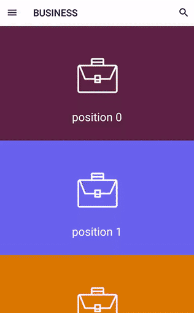

# Persei for Android
* Inspired by [Persei](https://github.com/Yalantis/Persei) for iOS.
*  Currently it's just a demo. Far away from a lib.
* MinSdkVersion is 21 due to the usage of [Circular Reveal Effect](https://developer.android.com/training/material/animations.html#Reveal). 

## Screenshot

## Implementation
The implementation is a little bit tricky. Please tell me if anyone has better thoughts.
#### Used components
* `TabLayout` wrapped in `AppBarLayout` for the tab bar.
* `FragmentTabHost` for holding tab content.
* `CoordinatorLayout` for interactions between tab bar and tab content.
* Custom view for ripple effect.
* Fragment enter transition for reveal effect.

#### Tricky part
* A little modification is made on `TabLayout` to remove the underline tab indicator.
* `FragmentTabHost` is also modified for two reasons:
	1. The detach of old fragment is delayed. Or reveal animation will perform on a white background instead of the old content.
	2. Before adding or attaching the new fragment, its reveal point must be updated through `FragmentTabHost` . Or reveal animation will always start from left-top corner.
* Use a custom `RippleView` instead of Android's ripple effect. 

## License
    Copyright (C) 2016, gelitenight(gelitenight@gmail.com).

    Licensed under the Apache License, Version 2.0 (the "License");
    you may not use this file except in compliance with the License.
    You may obtain a copy of the License at

         http://www.apache.org/licenses/LICENSE-2.0

    Unless required by applicable law or agreed to in writing, software
    distributed under the License is distributed on an "AS IS" BASIS,
    WITHOUT WARRANTIES OR CONDITIONS OF ANY KIND, either express or implied.
    See the License for the specific language governing permissions and
    limitations under the License.